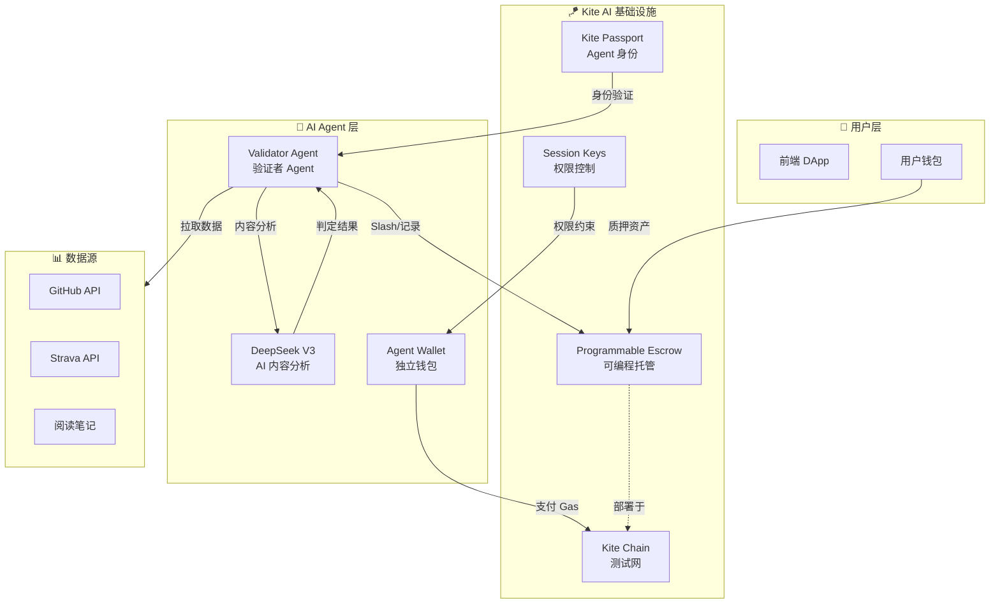

# Strict-Habit-Coach

基于 **Kite AI** 技术栈构建的 AI Agent 自动化支付应用 —— 让 AI Agent 监督你的自律，实现链上自动结算与风控。

# ⚖️ Strict Habit Coach (严格自律教练)

> **"要么自律，要么被 Agent Slash。"** —— 基于 Kite AI Agent Payment 的硬核习惯监督系统。

[](https://opensource.org/licenses/MIT)
[](https://docs.gokite.ai/)
[](https://testnet.kitescan.ai/)

## 📖 项目愿景

本项目构建了一个 **AI Agent 自主支付闭环**：

1. **用户质押资产** → AI Agent 托管至 Kite 可编程托管合约 (Programmable Escrow)
2. **AI Agent 每日验证** → 通过 DeepSeek V3 分析用户行为数据 (GitHub/Strava/阅读笔记)
3. **自动化结算** → Agent 根据验证结果自主发起链上支付 (Slash 或 奖励)
4. **风控权限** → 通过 Kite Session Keys 限制单次支付额度与操作范围

> 💡 **核心理念**: 让 AI Agent 成为「裁判」与「执行者」，实现真正的 Agent Economy。

## 🎬 项目演示

> 🚀 **[点击体验在线 Demo](https://coach-ruddy-eight.vercel.app/)**
>
> 📺 **[点击观看项目演示视频 (YouTube)](https://www.youtube.com/watch?v=OjpQhafxPfo)**
>
> 📄 **[查看项目完整演示文稿 (PPT/PDF)](./docs/Strict-Habit-Coach%20项目介绍%20.pdf)**

---

## 🛠️ Kite AI 技术集成

### 1. Kite Passport (Agent 身份系统)

```
Agent DID: did:kite:strict-habit-coach/validator-agent-v1
```

- AI Agent 拥有独立的加密身份，与用户建立完整信任链
- Agent 可验证用户授权，确保支付操作合法性
- 支持链上身份追溯与审计

### 2. Programmable Escrow (可编程托管合约)

我们的 `HabitEscrow.sol` 合约基于 Kite 可编程托管设计理念：

| 函数 | 说明 | Agent 权限 |
|------|------|-----------|
| `createChallenge` | 用户质押资产创建挑战 | 仅用户 |
| `slash` | AI 判定未达标时扣除质押金 | **Agent Only** |
| `recordDayComplete` | 记录每日打卡状态 | **Agent Only** |
| `claimReward` | 挑战成功后领取奖励 | 仅用户 |
| `emergencyWithdraw` | 紧急退出 (扣30%懦夫税) | 仅用户 |

### 3. Session Keys (支付权限控制)

AI Agent 的链上操作受到严格限制：

```solidity
// 权限配置示例
struct AgentPermission {
    uint256 maxSlashPerDay;    // 单日最大 Slash 额度: 0.1 ETH
    uint256 maxTotalSlash;     // 单挑战最大 Slash 总额: 质押金的 100%
    uint256 operationWindow;   // 操作时间窗口: 每日 23:00-24:00
    address[] allowedTargets;  // 允许操作的合约地址
}
```

### 4. Kite AI Testnet 部署信息

| 配置项 | 值 |
|--------|-----|
| Network | KiteAI Testnet |
| Chain ID | 2368 |
| RPC URL | https://rpc-testnet.gokite.ai/ |
| Block Explorer | [Kite Explorer](https://testnet.kitescan.ai/) |
| Token | KITE |
| Faucet | https://faucet.gokite.ai |
| 合约地址 (HabitEscrow) | [`0x6E577Db34B60fEb65c19b26a91c309B969bAA12F`](https://testnet.kitescan.ai/address/0x6E577Db34B60fEb65c19b26a91c309B969bAA12F) |
| 合约地址 (StrictToken) | [`0x3f7120711c122274b9cB4d8D72A16B49e06d86f1`](https://testnet.kitescan.ai/address/0x3f7120711c122274b9cB4d8D72A16B49e06d86f1) |

---

## 🏗️ 系统架构



---

## 📊 AI Agent Payment 核心流程


---

## 🚀 快速启动 (本地开发)

### 环境要求

- Node.js >= 18
- Java 17 (后端)
- Foundry (合约部署)
- MetaMask 钱包 (连接 Kite AI Testnet)

### 1. 克隆项目

```bash
git clone https://github.com/ggus39/Strict-Habit-Coach.git
cd Strict-Habit-Coach
```

### 2. 配置 Kite AI Testnet 网络

在 MetaMask 中添加 Kite AI 测试网：

| 配置项 | 值 |
|--------|-----|
| Network Name | KiteAI Testnet |
| RPC URL | https://rpc-testnet.gokite.ai/ |
| Chain ID | 2368 |
| Currency Symbol | KITE |
| Block Explorer | https://testnet.kitescan.ai/ |

### 3. 获取测试代币

访问 Kite Faucet 获取测试 KITE 代币：https://faucet.gokite.ai

### 4. 启动前端 (本地开发)

```bash
cd frontend
npm install
npm run dev
```

### 5. 启动后端 (AI Agent)

```bash
cd backend
./mvnw spring-boot:run
```

### 6. 体验完整流程

1. 连接钱包 → 选择 Kite AI Testnet
2. 创建挑战 → 质押 KITE 代币
3. 完成习惯 → 提交 GitHub Commit / Strava运动记录 / 笔记记录
4. AI Agent 自动验证 → 查看链上交易记录
5. 周期结束 → 领取奖励

### 链上交易记录 

| 操作 | 交易哈希 | 区块浏览器 |
|------|---------|-----------|
| 创建挑战 | `0x88993c39...` | [查看](https://testnet.kitescan.ai/tx/0x88993c39ff54c28337d4f7da13ab8f00d629647685751ac50e70e683ecdb0844) |
| AI Slash | `0x1aed52e4...` | [查看](https://testnet.kitescan.ai/tx/0x1aed52e4d0a88bf9bc8865ebb3e7e0903ef918aa70c75f0342850eebb5c097e2) |
| 领取奖励 | `0x445ed639...` | [查看](https://testnet.kitescan.ai/tx/0x445ed639705b13a273b9f37d88941bd7cce5f07cd0039f4491eee273a3540ebb) |

---

## 🏭 生产环境部署

### 一、智能合约部署 (Foundry)

#### 1.1 安装 Foundry

```bash
# Linux/Mac/WSL
curl -L https://foundry.paradigm.xyz | bash
foundryup

# 验证安装
forge --version
```

#### 1.2 配置环境变量

在 `contracts/` 目录下创建 `.env` 文件：

```env
# 部署者私钥 (同时也将成为初始 Agent)
PRIVATE_KEY_ETH=your_private_key_here
```

#### 1.3 编译并部署合约

```bash
cd contracts

# 编译
forge build

# 部署到 Kite AI Testnet
forge script script/Deploy.s.sol:DeployScript \
    --rpc-url https://rpc-testnet.gokite.ai/ \
    --broadcast \
    -vvvv
```

#### 1.4 部署成功输出

```
== Logs ==
  StrictToken deployed to: 0x3f7120711c122274b9cB4d8D72A16B49e06d86f1
  HabitEscrow deployed to: 0x6E577Db34B60fEb65c19b26a91c309B969bAA12F
  Transferred 100000000000000000000000000 STRICT tokens to Escrow
```

#### 1.5 更新前端合约地址

将部署的合约地址更新到 `frontend/contracts/index.ts`：

```typescript
export const HABIT_ESCROW_ADDRESS = '0x6E577Db34B60fEb65c19b26a91c309B969bAA12F';
export const STRICT_TOKEN_ADDRESS = '0x3f7120711c122274b9cB4d8D72A16B49e06d86f1';
```

---

### 二、后端部署 (Spring Boot)

#### 2.1 配置环境变量

设置以下环境变量（可通过服务器环境变量或 `application-prod.yaml` 配置）：

```bash
# 数据库配置
MYSQL_HOST=localhost
MYSQL_PORT=3306
MYSQL_DATABASE=strict_habit
MYSQL_USERNAME=root
MYSQL_PASSWORD=your_password

# GitHub OAuth (可选)
GITHUB_CLIENT_ID=your_github_client_id
GITHUB_CLIENT_SECRET=your_github_client_secret

# Strava OAuth (可选)
STRAVA_CLIENT_ID=your_strava_client_id
STRAVA_CLIENT_SECRET=your_strava_client_secret

# AI Agent 链上交易配置
AGENT_PRIVATE_KEY=your_agent_private_key
KITE_RPC_URL=https://rpc-testnet.gokite.ai/

# 前端 URL (用于 OAuth 回调)
FRONTEND_URL=https://your-frontend.vercel.app
```

#### 2.2 构建 JAR 包

```bash
cd backend
./mvnw clean package -DskipTests
```

#### 2.3 运行后端服务

```bash
# 开发环境
./mvnw spring-boot:run

# 生产环境
java -jar target/strict-habit-coach-0.0.1-SNAPSHOT.jar --spring.profiles.active=prod
```

---

### 三、前端部署 (Vercel)

#### Vercel CLI 部署

```bash
cd frontend

# 安装 Vercel CLI
npm i -g vercel

# 登录 Vercel
vercel login

# 部署到生产环境
vercel --prod
```


---


## 📂 项目结构

```
Strict-Habit-Coach/
├── frontend/                 # React + Vite 前端
│   ├── pages/               # 页面组件
│   ├── components/          # 通用组件
│   └── contracts/           # 合约 ABI 与地址
├── backend/                  # Spring Boot 后端 (AI Agent)
│   ├── agent/               # AI Agent 集成
│   ├── service/             # 业务逻辑
│   └── web3/                # 链上交互
├── contracts/                # Solidity 智能合约
│   ├── HabitEscrow.sol      # 可编程托管合约
│   └── StrictToken.sol      # ERC20 激励代币
└── README.md
```

---

## 🔗 相关链接

- **Kite AI 官方文档**: https://docs.gokite.ai/
- **Kite Chain 区块浏览器**: https://testnet.kitescan.ai/
- **Kite Faucet**: https://faucet.gokite.ai
- **项目仓库**: https://github.com/ggus39/Strict-Habit-Coach

---

## 👨‍💻 团队信息

| 成员 | 角色 | GitHub |
|------|------|--------|
| ggus39 | 产品经理 | [@ggus39](https://github.com/ggus39) |
| Oronm | 全栈开发 | [@Oronm-boop](https://github.com/Oronm-boop) |
| mengchenxin | UI 设计 | [@mengchenxin](https://github.com/mengchenxin) |

---

## 📄 License

MIT License - 详见 [LICENSE](./LICENSE)
