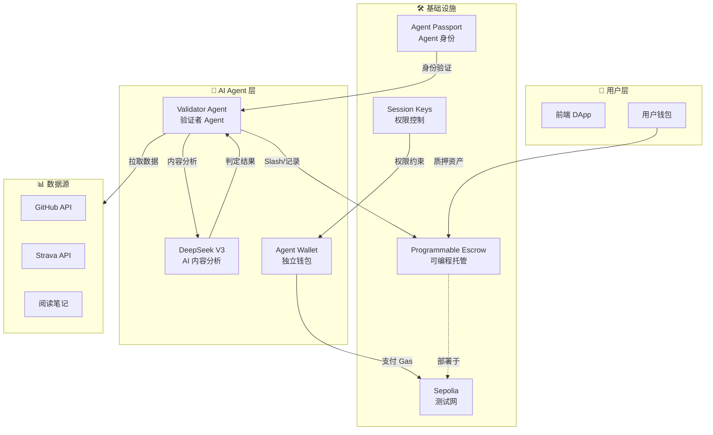
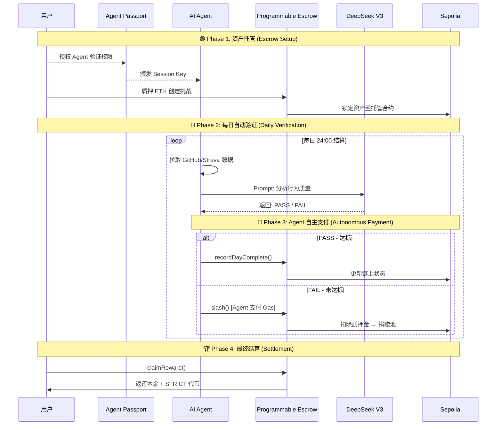

# Strict-Habit-Coach

基于 **Kite AI** 技术栈构建的 AI Agent 自动化支付应用 —— 让 AI Agent 监督你的自律，实现链上自动结算与风控。

# ⚖️ Strict Habit Coach (严格自律教练)

> **"要么自律，要么被 Agent Slash。"** —— 基于 Kite AI Agent Payment 的硬核习惯监督系统。

[](https://opensource.org/licenses/MIT)
[](https://docs.gokite.ai/)
[](https://sepolia.etherscan.io/)

## 📖 项目愿景

本项目构建了一个 **AI Agent 自主支付闭环**：

1. **用户质押资产** → AI Agent 托管至 Kite 可编程托管合约 (Programmable Escrow)
2. **AI Agent 每日验证** → 通过 DeepSeek V3 分析用户行为数据 (GitHub/Strava/阅读笔记)
3. **自动化结算** → Agent 根据验证结果自主发起链上支付 (Slash 或 奖励)
4. **风控权限** → 通过 Kite Session Keys 限制单次支付额度与操作范围

> 💡 **核心理念**: 让 AI Agent 成为「裁判」与「执行者」，实现真正的 Agent Economy。

---

## 🛠️ Kite AI 技术集成

### 1. Kite Passport (Agent 身份系统)

```
Agent DID: did:kite:strict-habit-coach/validator-agent-v1
```

- AI Agent 拥有独立的加密身份，与用户建立完整信任链
- Agent 可验证用户授权，确保支付操作合法性
- 支持链上身份追溯与审计

### 2. Programmable Escrow (可编程托管合约)

我们的 `HabitEscrow.sol` 合约基于 Kite 可编程托管设计理念：

| 函数 | 说明 | Agent 权限 |
|------|------|-----------|
| `createChallenge` | 用户质押资产创建挑战 | 仅用户 |
| `slash` | AI 判定未达标时扣除质押金 | **Agent Only** |
| `recordDayComplete` | 记录每日打卡状态 | **Agent Only** |
| `claimReward` | 挑战成功后领取奖励 | 仅用户 |
| `emergencyWithdraw` | 紧急退出 (扣30%懦夫税) | 仅用户 |

### 3. Session Keys (支付权限控制)

AI Agent 的链上操作受到严格限制：

```solidity
// 权限配置示例
struct AgentPermission {
    uint256 maxSlashPerDay;    // 单日最大 Slash 额度: 0.1 ETH
    uint256 maxTotalSlash;     // 单挑战最大 Slash 总额: 质押金的 100%
    uint256 operationWindow;   // 操作时间窗口: 每日 23:00-24:00
    address[] allowedTargets;  // 允许操作的合约地址
}
```

### 4. Sepolia 测试网 部署信息

| 配置项 | 值 |
|--------|-----|
| Network | Sepolia Testnet |
| Chain ID | 11155111 |
| RPC URL | https://sepolia.infura.io/v3/APIkey |
| Block Explorer | [TESTNET Sepolia (ETH) Blockchain Explorer](https://sepolia.etherscan.io/) |
| 合约地址 (HabitEscrow) | `0xcECDE33801aDa871ABD5cd0406248B8A70a6FC32` (已部署) |
| 合约地址 (StrictToken) | `0xba1180cC038342d9be147cfeC8490af8c44aCE44` (已部署) |

---

## 🏗️ 系统架构



---

## 📊 AI Agent Payment 核心流程



---

## 🚀 快速启动

### 环境要求

- Node.js >= 18
- Java 17 (后端)
- MetaMask 钱包 (连接 Sepolia Testnet)

### 1. 克隆项目

```bash
git clone https://github.com/ggus39/Strict-Habit-Coach.git
cd Strict-Habit-Coach
```

### 2. 配置 Sepolia Testnet 网络

在 MetaMask 中添加 sepolia testnet Chain 测试网：

| 配置项 | 值 |
|--------|-----|
| Network Name | Sepolia Testnet |
| RPC URL | https://rpc.sepolia.org      |
| Chain ID | 11155111                     |
| Currency Symbol | SepoliaETH                   |
| Block Explorer | https://sepolia.etherscan.io |

### 3. 启动前端

```bash
cd frontend
npm install
npm run dev
```

### 4. 启动后端 (AI Agent)

```bash
cd backend
./mvnw spring-boot:run
```

### 5. 体验完整流程

1. 连接钱包 → 选择 Sepolia Testnet
2. 创建挑战 → 质押 ETH
3. 完成习惯 → 提交 GitHub Commit / Strava运动记录 / 笔记记录
4. AI Agent 自动验证 → 查看链上交易记录
5. 周期结束 → 领取奖励

---

## 🎬 演示

### 演示视频

> 📹 [点击观看完整演示视频](./demo/demo_video.mp4)

### 链上交易记录

| 操作 | 交易哈希 | 区块浏览器 |
|------|---------|-----------|
| 创建挑战 | `0xe7b95c73...` | [查看](https://sepolia.etherscan.io/tx/0xe7b95c7368f3d99545ea7bb04ea8874dd9b4b05791f0a7480f71aed4ca0a188b) |
| AI Slash | `0x92b853dd...` | [查看](https://sepolia.etherscan.io/tx/0x92b853dd9269934a332feb5c906eb2b0ee45be220baa61647a6829daa460fe72) |
| 领取奖励 | `0x0ba7a5aa...` | [查看](https://sepolia.etherscan.io/tx/0x0ba7a5aa43a9276b3d3810ac62a5ff1e37da5bb3fe1c5e91790ae6a1496cc7d0) |

---

## 📂 项目结构

```
Strict-Habit-Coach/
├── frontend/                 # React + Vite 前端
│   ├── pages/               # 页面组件
│   ├── components/          # 通用组件
│   └── contracts/           # 合约 ABI 与地址
├── backend/                  # Spring Boot 后端 (AI Agent)
│   ├── agent/               # AI Agent 集成
│   ├── service/             # 业务逻辑
│   └── web3/                # 链上交互
├── contracts/                # Solidity 智能合约
│   ├── HabitEscrow.sol      # 可编程托管合约
│   └── StrictToken.sol      # ERC20 激励代币
└── README.md
```

---

## 🔗 相关链接

- **Kite AI 官方文档**: https://docs.gokite.ai/
- **Sepolia 区块浏览器**: https://sepolia.etherscan.io/
- **项目仓库**: https://github.com/ggus39/Strict-Habit-Coach

---

## 👨‍💻 团队信息

| 成员 | 角色 | GitHub |
|------|------|--------|
| ggus39 | 全栈开发 & AI Agent | [@ggus39](https://github.com/ggus39) |

---

## 📄 License

MIT License - 详见 [LICENSE](./LICENSE)
