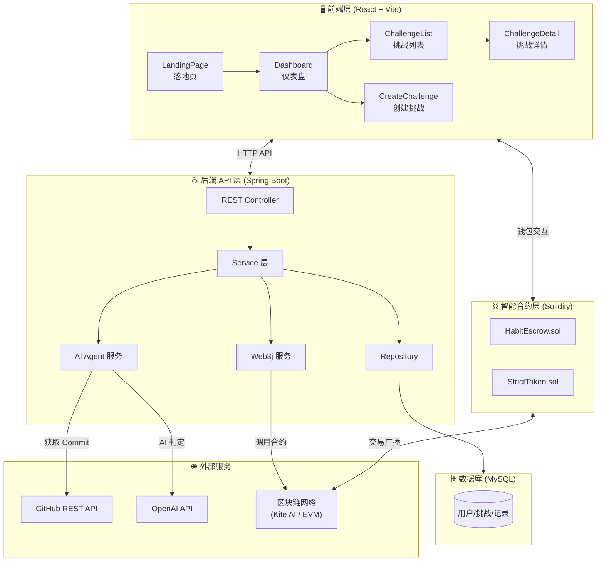
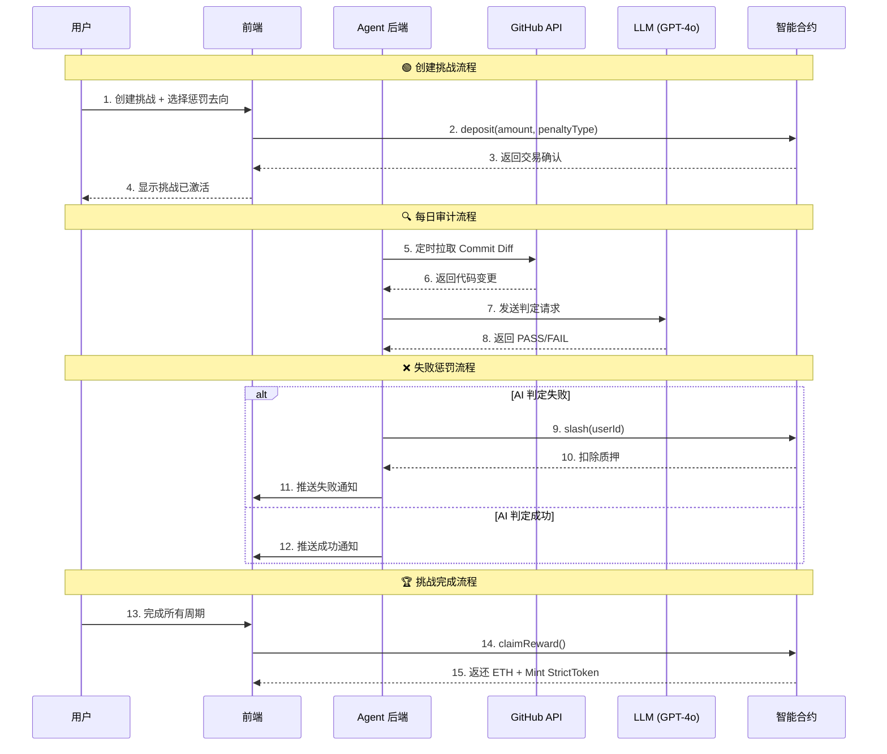
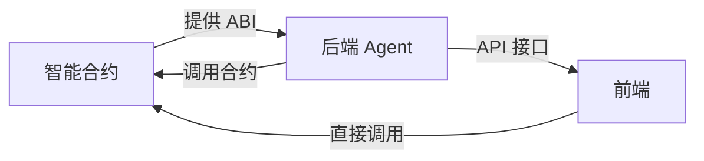

# 🏗️ Strict Habit Coach - 系统架构

## 架构总览



---

## 📊 数据流图



---

## 🧩 模块职责

### 1. 前端层 (`/frontend`)
| 页面 | 职责 |
|------|------|
| `LandingPage.tsx` | 产品介绍、CTA 引导 |
| `Dashboard.tsx` | 用户数据总览、钱包连接 |
| `CreateChallenge.tsx` | 创建挑战、设置惩罚类型 |
| `ChallengeList.tsx` | 查看所有挑战 |
| `ChallengeDetail.tsx` | 单个挑战详情、进度、AI 评价 |

### 2. 后端 Agent 层 (`/agent`)
| 函数 | 职责 |
|------|------|
| `fetchGitHubData()` | 从 GitHub API 拉取用户的 Commit 和 Diff |
| `askLLM(data)` | 调用 GPT-4o 判定代码质量 |
| `executeSlash(user)` | 使用服务端钱包签名调用合约 `slash()` |
| `scheduleAudit()` | 定时任务触发器 (Cron) |

### 3. 智能合约层 (`/contracts`)

#### StrictToken.sol - ERC20 代币
| 属性/函数 | 说明 |
|----------|------|
| `TOTAL_SUPPLY` | 总供应量 1亿 STRICT |
| `constructor()` | 铸造全部代币给部署者 |

#### HabitEscrow.sol - 托管合约
| 函数 | 职责 |
|------|------|
| `createChallenge()` | 用户质押 ETH 创建挑战，选择惩罚去向 |
| `slash(user, challengeId)` | Agent 专属：执行惩罚 |
| `emergencyWithdraw()` | "认怂退出"，扣 30% 懦夫税 |
| `claimReward()` | 挑战成功后领取本金 + STRICT 奖励 |
| `useResurrection()` | 使用复活卡重置挑战进度 |
| `recordDayComplete()` | Agent 记录每日完成 |

---

## 🚀 开发建议：先合约还是先后端？

> [!IMPORTANT]
> **建议：先开发智能合约 → 再开发后端 Agent**

### 理由



1. **合约是核心基础设施**
   - 后端需要 ABI 才能调用合约
   - 前端也需要合约地址和 ABI 进行钱包交互
   - 合约一旦部署，接口就固定了

2. **开发顺序**
   ```
   Step 1: 智能合约 (HabitEscrow.sol)
      ↓ 获得 ABI + 合约地址
   Step 2: 后端 Agent (route.ts)
      ↓ 提供 API 接口
   Step 3: 前端集成 (调用真实合约和 API)
   ```

3. **合约优先的好处**
   - 可以先用 Remix 或 Hardhat 测试合约逻辑
   - 后端开发时有明确的调用目标
   - 减少返工风险

---

## 📁 推荐目录结构

```
Strict-Habit-Coach/
├── contracts/                 # 智能合约
│   ├── HabitEscrow.sol        # 主合约
│   ├── StrictToken.sol        # ERC20 奖励代币
│   └── hardhat.config.js      # Hardhat 配置
│
├── agent/                     # 后端 Agent
│   ├── route.ts               # API 路由入口
│   ├── services/
│   │   ├── github.ts          # GitHub API 封装
│   │   ├── llm.ts             # LLM 调用封装
│   │   └── contract.ts        # 合约交互封装
│   ├── jobs/
│   │   └── audit.ts           # 定时审计任务
│   └── server.ts              # 服务器入口
│
├── frontend/                  # 前端 (已完成静态页面)
│   ├── pages/
│   ├── components/
│   └── ...
│
└── architecture.md            # 架构文档 (本文件)
```

---

## ✅ 下一步 Action Items

- [ ] **合约开发**：完成 `HabitEscrow.sol` 核心逻辑
- [ ] **合约测试**：使用 Hardhat 编写测试用例
- [ ] **合约部署**：部署到测试网 (Kite AI Testnet / Sepolia)
- [ ] **后端开发**：实现 Agent 的 GitHub 数据采集 + LLM 判定 + 合约调用
- [ ] **前端集成**：接入真实合约和 API
