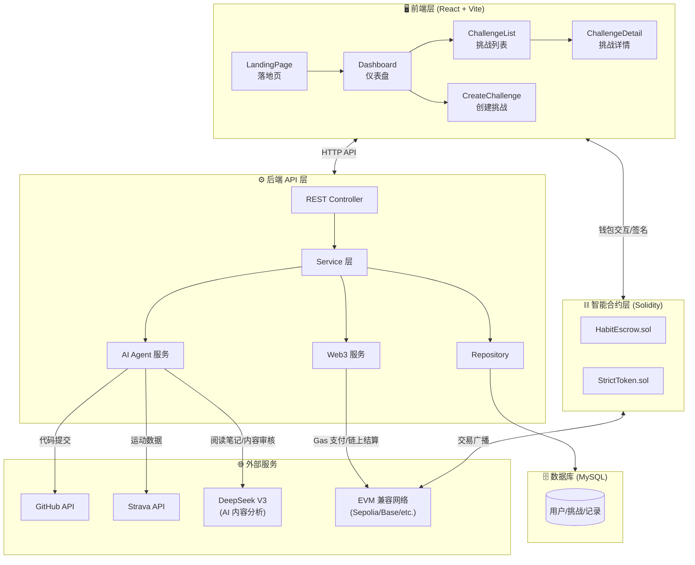
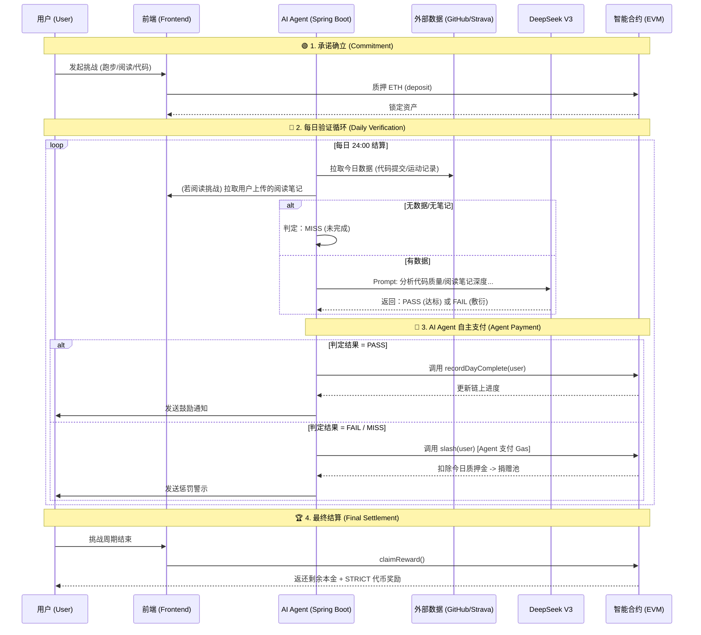

# 🏗️ Strict Habit Coach - 系统架构

## 架构总览

---

## 📊 核心业务流程：AI Agent Payment Loop

本系统的核心在于 **无人工干预的自动化验证与支付闭环**。AI Agent 拥有独立的链上钱包，根据 DeepSeek V3 的分析结果自动签署交易。

---

## 🧩 模块职责

### 1. 前端层 (`/frontend`)
| 页面 | 职责 |
|------|------|
| `LandingPage.tsx` | 产品理念介绍、AI Agent Payment 概念展示 |
| `Dashboard.tsx` | 个人资产看板、STRICT 代币余额、挑战状态概览 |
| `CreateChallenge.tsx` | 创建挑战、设置质押金额与习惯类型 |
| `ChallengeDetail.tsx` | 详细进度追踪、查看 AI 对阅读笔记/代码的评价 |

### 2. 后端与 AI Agent 层 (`/backend`)
*   **数据聚合**: 定时从 GitHub (代码)、Strava (运动) 拉取原始行为数据。
*   **内容分析**: 接收用户提交的阅读笔记。
*   **AI 核心 (DeepSeek V3)**:
    *   分析代码 Commit 的有效性（非简单的空格修改）。
    *   分析阅读笔记的深度与真实性（防止复制粘贴）。
    *   分析运动数据的真实性。
*   **Agent Payment**: 封装 Web3j，管理 Agent 私钥，自主发起链上交易（Slash 或 记录进度）。

### 3. 智能合约层 (`/contracts`)

#### StrictToken.sol - ERC20 激励代币
*   用户完成挑战后的额外奖励。

#### HabitEscrow.sol - 核心托管逻辑
| 函数 | 说明 |
|------|------|
| `createChallenge` | 用户端调用，质押 ETH 创建条站并锁定资金。 |
| `slash` | **仅限 Agent 调用**。当 AI 判定未达标时，扣除质押金。 |
| `recordDayComplete` | **仅限 Agent 调用**。记录每日打卡状态，累积天数。 |
| `claimReward` | 用户端调用。挑战成功后取回本金和代币。 |
| `emergencyWithdraw` | 用户端调用。紧急“认怂”退出，扣除 30% 懦夫税。 |
| `useResurrection` | 用户端调用。消耗复活卡重置当前周期进度。 |

